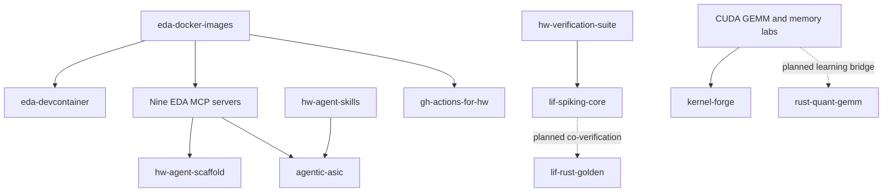

# Project relationships

Arrows show tool, runtime, or learning relationships, not npm dependency declarations. `agentic-asic` orchestrates the ASIC subset of servers; FPGA and SPICE servers are also distributed by the scaffold. The Rust public repositories are future phases. Private Rust fundamentals remain outside the public showcase.
